<p align="center">
  
</p>

<p align="center">
  <strong>An Anthropic-aligned execution framework that brings agile delivery discipline to Claude Code.</strong>
</p>

<p align="center">
  <a href="#quick-start">Quick Start</a> &nbsp;&bull;&nbsp;
  <a href="#how-it-works">How It Works</a> &nbsp;&bull;&nbsp;
  <a href="#dashboard">Dashboard</a> &nbsp;&bull;&nbsp;
  <a href="#web-ui">Web UI</a> &nbsp;&bull;&nbsp;
  <a href="#documentation">Documentation</a> &nbsp;&bull;&nbsp;
  <a href="#cross-platform">Cross-Platform</a>
</p>

---

## Why StoryForge?

Claude Code is powerful, but without structure it drifts. You start fixing a bug and end up refactoring three modules. A "quick feature" grows into an unplanned rewrite. Context is lost between sessions.

**StoryForge solves this.** It wraps Claude Code in a lightweight agile operating system:

- Every session starts with a **board check** — what's in progress, what's next
- Every piece of work maps to an **Initiative > Feature > Story > Task** hierarchy
- New ideas go to **Backlog**, not into the current scope
- A **portfolio-orchestrator** agent enforces discipline across all projects
- Work is not **Done** until implementation, tests, and artifacts are all updated

No external tools. No databases. Just markdown files, Claude Code primitives, and a clear process.

## How It Works

StoryForge operates at two levels:

```
~/.claude/                          Per-project
  CLAUDE.md      (global rules)      .claude/CLAUDE.md   (project rules)
  settings.json  (hooks, perms)      .claude/settings.json
  agents/        (6 agents)          .kanban/
  skills/        (6 skills)            board.md
  rules/         (delivery rules)      backlog.md
                                       sprint.md
                                       stories/STORY-001.md
                                       decisions.md
                                       changelog.md
```

| Layer | What it provides |
|:------|:-----------------|
| **Global** (`~/.claude/`) | Operating rules, agents, skills, hooks — active in every session |
| **Project** (`.claude/` + `.kanban/`) | Project-specific config and delivery tracking artifacts |

### Agents

| Agent | Role |
|:------|:-----|
| `portfolio-orchestrator` | Top-level coordinator. Checks the board, validates scope, delegates to specialists |
| `planner` | Creates initiatives, features, stories with acceptance criteria |
| `implementer` | Executes bounded work within the active story scope |
| `reviewer` | Verifies quality, story compliance, and artifact consistency |
| `doc-maintainer` | Updates board, changelog, decisions, and backlog |
| `security-auditor` | Post-sprint security review — scans for secrets, injections, misconfigs |
| `upstream-watch` | Monitors Anthropic docs for changes that affect StoryForge |

### Skills

| Skill | Usage |
|:------|:------|
| `/kanban-bootstrap` | Initialize `.kanban/` structure in any project |
| `/story-write` | Create a new story with structured fields |
| `/sprint-groom` | Plan or review a sprint |
| `/dashboard` | Display the Kanban dashboard |
| `/release-adapt` | Process an upstream Claude Code change |
| `/doc-update` | Update delivery artifacts after work completes |
| `/security-audit` | Run security scan (required before sprint closure) |
| `/upstream-check` | Check Anthropic docs for upstream changes |
| `/gh-link` | Link a story to a GitHub issue or PR |

### Hooks

| Event | Behavior |
|:------|:---------|
| `SessionStart` | Reminds Claude to check `.kanban/board.md` before working |
| `SessionResume` | Re-injects board context on session resume |
| `Stop` | Reminds to update artifacts if changes were made (loop-safe) |
| `PostToolUse` | Reminds to update board when story files are edited |
| `Notification` | Alerts when Claude needs user input |

### Kanban Flow

```
  Backlog ──> Ready ──> In Progress ──> Review ──> Done
     │                       │                       │
     │  New ideas land       │  One story at a time  │  All criteria met
     │  here by default      │  Scope is fixed       │  Tests pass
     └───────────────────────┴───────────────────────┘  Artifacts updated
```

## Quick Start

### 1. Install the global layer

<table>
<tr><td><strong>Bash</strong> (macOS / Linux / Git Bash)</td><td><strong>PowerShell</strong> (Windows)</td></tr>
<tr>
<td>

```bash
git clone https://github.com/toonight/StoryForge.git
cd StoryForge
./scripts/install_storyforge.sh
```

</td>
<td>

```powershell
git clone https://github.com/toonight/StoryForge.git
cd StoryForge
.\scripts\install_storyforge.ps1
```

</td>
</tr>
</table>

### 2. Bootstrap a project

```bash
cd /path/to/your-project

# Bash
/path/to/StoryForge/scripts/bootstrap_project.sh

# PowerShell
/path/to/StoryForge/scripts/bootstrap_project.ps1
```

This creates `.claude/` (project config) and `.kanban/` (delivery artifacts).

### 3. Start working

```
1. Open Claude Code in your project
2. Claude reads the board automatically (SessionStart hook)
3. Use /story-write to plan your first story
4. Implement within the story scope
5. Use /doc-update when done
```

## Dashboard

StoryForge includes a terminal dashboard that renders your Kanban state at a glance.

```bash
python scripts/dashboard.py
```

```
══════════════════════════════════════════════════════════════════════
                  STORYFORGE DASHBOARD — MyProject
══════════════════════════════════════════════════════════════════════

  KANBAN BOARD

    ○ Backlog     ◉ Ready     ▶ In Progress    ◈ Review     ✓ Done
                                █                            ████
        2            1            1               0            4

  Progress: ████████████████████████████████░░░░░░░░░░░░░░░░ 50% (4/8)

  FEATURES
    FEAT-001  Authentication System      [Done]
    FEAT-002  API Rate Limiting          [In Progress]

  ACTIVE STORIES
    ▶ STORY-005: Add rate limiter middleware
      Criteria: ██████████░░░░░░░░░░ 2/4 (50%)

  SPRINT
    Sprint 3 — API Hardening
    Stories: 4 total, 2 done, 1 in progress, 1 remaining
    Burndown: ██████████████████████░░░░░░░░ 50%
```

- Python 3.8+ (stdlib only, zero dependencies)
- ANSI colors with graceful fallback
- Works on Windows, macOS, and Linux

## Web UI

For a visual board, StoryForge also includes a local web interface:

```bash
python scripts/kanban_webui.py
```

Opens a browser with an interactive Kanban board featuring:

- **Board view** — 5 columns (Backlog, Ready, In Progress, Review, Done) with story cards
- **Features view** — grid of all features grouped by initiative
- **Backlog view** — future work items
- **Story modals** — click any card to see details, acceptance criteria, and progress
- **JSON API** — available at `/api/board` for integrations

Dark theme, zero dependencies, runs on `http://127.0.0.1:8742`.

## Cross-Platform

Every script ships in both **Bash** and **PowerShell**:

| Script | Bash | PowerShell |
|:-------|:-----|:-----------|
| Install global config | `install_storyforge.sh` | `install_storyforge.ps1` |
| Bootstrap a project | `bootstrap_project.sh` | `bootstrap_project.ps1` |
| Validate templates | `validate_templates.sh` | `validate_templates.ps1` |
| Sync upstream docs | `sync_upstream_docs.sh` | `sync_upstream_docs.ps1` |
| Kanban dashboard | `dashboard.py` | `dashboard.py` |
| Kanban web UI | `kanban_webui.py` | `kanban_webui.py` |
| Security audit | `security_audit.py` | `security_audit.py` |
| Upstream monitor | `upstream_monitor.py` | `upstream_monitor.py` |
| Release validation | `validate_release.py` | `validate_release.py` |

## Source of Truth Policy

StoryForge clearly separates what comes from Anthropic and what it adds on top:

| Classification | Meaning | Example |
|:---------------|:--------|:--------|
| **Native** | Officially supported by Claude Code | `CLAUDE.md` loading, hooks, agent frontmatter, permissions |
| **Convention** | StoryForge pattern layered on native primitives | Kanban board, story templates, agile workflow rules |
| **Enforcement** | Native mechanism used for guarantees | Permission deny rules, hook-based validators |

> CLAUDE.md guidance is contextual. Settings and permissions are enforcement.
> Hooks are lifecycle automation. Kanban discipline is a StoryForge convention.
>
> These categories are never blurred.

See [anthropic-source-map.md](docs/anthropic-source-map.md) for the full mapping.

## Documentation

| Document | Purpose |
|:---------|:--------|
| [Architecture](docs/architecture.md) | System design, layers, agent strategy, data flow |
| [Operating Model](docs/operating-model.md) | Work hierarchy, Kanban states, done criteria, anti-drift rules |
| [Source of Truth Policy](docs/source-of-truth-policy.md) | Authority levels, classification system |
| [Anthropic Source Map](docs/anthropic-source-map.md) | Every capability mapped to its official Anthropic source |
| [Upstream Doc Index](docs/upstream/doc-index.md) | 15 Anthropic doc pages with verification dates |
| [Release Watch](docs/upstream/release-watch.md) | Upstream change tracking and impact classification |
| [Adaptation Process](docs/upstream/changelog-adaptation-process.md) | How StoryForge adapts to Claude Code updates |

## Project Structure

```
storyforge/
  .claude/                    # StoryForge's own project config
    CLAUDE.md                 # Project-specific rules
    rules/                    # Path-specific rules (templates, docs, scripts)
  assets/                     # Banner and visual assets
  docs/                       # Architecture, policies, upstream tracking
  templates/
    home/.claude/             # User-level templates (~/.claude/)
      agents/                 # 8 agent definitions
      skills/                 # 9 skill definitions
      rules/                  # Global delivery rules
      CLAUDE.md               # Global operating system
      settings.json           # Hooks, permissions, safe defaults
    project/                  # Per-project templates
      .claude/                # Project config template
      .kanban/                # Kanban artifact templates
  scripts/                    # Bash + PowerShell + Python tooling
  tests/                      # 238 pytest tests
  examples/                   # Sample project with populated .kanban/
```

## Validation

```bash
# Run the full test suite (154 tests)
python -m pytest tests/ -v

# Run the template validation script
bash scripts/validate_templates.sh     # or .\scripts\validate_templates.ps1
```

## License

[MIT](LICENSE)

---

<p align="center">
  <sub>Built with discipline on <a href="https://claude.com/claude-code">Claude Code</a></sub>
</p>
